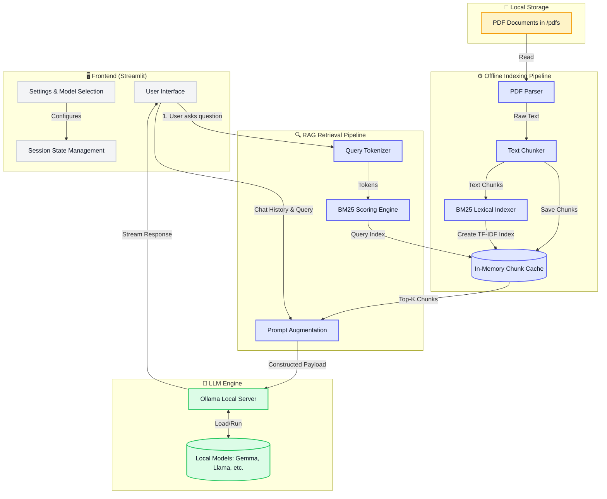

# CMS-0057F Health Plan AI Assistant

## Project Overview
This project provides a local, privacy-preserving AI Assistant designed specifically for U.S. Health Plans to navigate and implement the **CMS Interoperability and Prior Authorization Final Rule (CMS-0057-F)**. 

By leveraging local LLMs (via Ollama) and a Retrieval-Augmented Generation (RAG) pipeline against your own indexed PDF library, this chatbot helps Health Plan IT/technical staff and business/operations staff quickly find grounded, cited answers regarding compliance dates, API specifications (Patient Access, Provider Access, Payer-to-Payer, DRLS), and prior authorization requirements without sending sensitive patient or proprietary data to the cloud.

This version runs entirely locally and does not require OpenAI API credits or external internet access for inference.

## What is Ollama?
Ollama allows you to run open-source LLMs locally on your own laptop.

Examples:
- Llama
- Mistral
- Gemma
- Qwen

## Architecture

This diagram illustrates the end-to-end architecture of your local AI Assistant, highlighting the Streamlit frontend, the lightweight BM25 Retrieval-Augmented Generation (RAG) pipeline, and the local Ollama LLM integration.



### Key Components

> [!TIP]
> This architecture is fully local and runs entirely on your machine without requiring external API calls or cloud dependencies.

1. **Frontend**: Built with Streamlit, handling the user interface, session state (chat history), and application settings.
2. **Indexing**: Instead of a vector database, this solution uses a lightweight **BM25 lexical search algorithm**. It tokenizes the text from the PDFs and scores them based on term frequency (TF-IDF), storing the chunks in memory.
3. **Retrieval**: When a query is made, it is tokenized and scored against the BM25 index to extract the Top-K most relevant document chunks.
4. **LLM Engine**: The augmented prompt (containing the system instructions, chat history, user query, and retrieved document context) is sent to a local **Ollama** server, which streams the generated response back to the UI.

## Step 1 — Install Ollama

Download and install Ollama from:

https://ollama.com

After installation, open terminal and check:

```bash
ollama --version
```

## Step 2 — Pull a model

Recommended beginner model:

```bash
ollama pull llama3.2
```

If your laptop has less RAM, try smaller models if available.

Other options:

```bash
ollama pull llama3
ollama pull mistral
ollama pull gemma2
ollama pull qwen2.5
```

## Step 3 — Run Ollama

Usually Ollama runs automatically after installation.

If not, run:

```bash
ollama serve
```

Keep this terminal open.

## Step 4 — Create virtual environment

```bash
python -m venv venv
```

## Step 5 — Activate virtual environment

Windows:

```bash
venv\Scripts\activate
```

Mac/Linux:

```bash
source venv/bin/activate
```

## Step 6 — Install packages

```bash
pip install -r requirements.txt
```

## Step 7 — Run Streamlit app

```bash
streamlit run app.py
```

## Important
If you select a model in the sidebar, that model must be downloaded first.

Example:

If selected model is `mistral`, run:

```bash
ollama pull mistral
```

