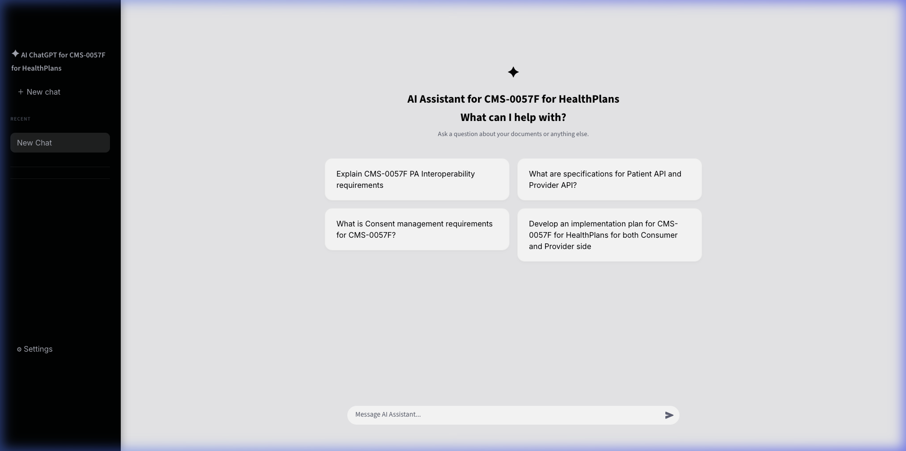
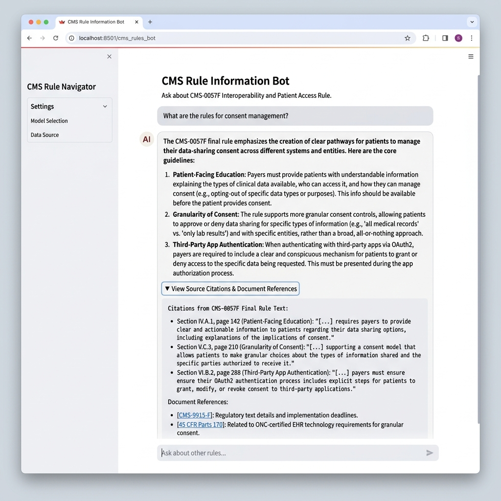
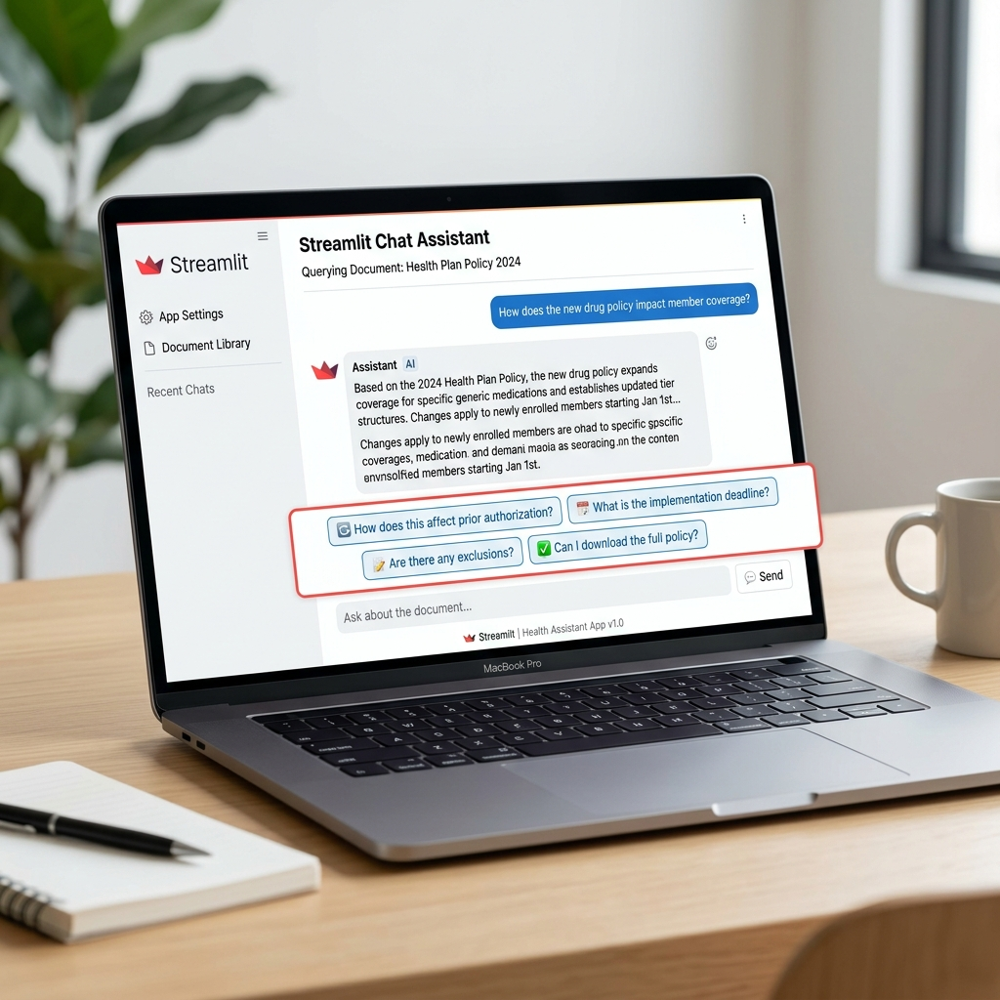
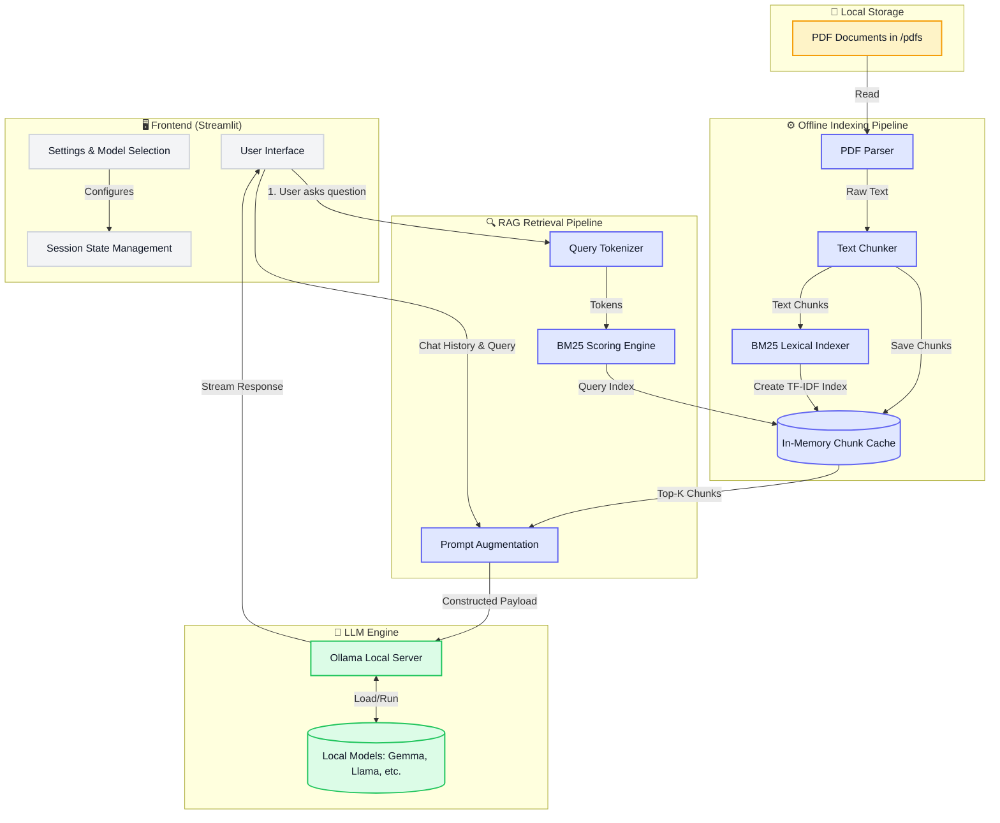

# CMS-0057F Health Plan AI Assistant

## Project Overview
This project provides a local, privacy-preserving AI assistant built for Health Plans to query and explore the **CMS-0057F Interoperability and Prior Authorization Final Rule**. This application leverages offline LLMs via Ollama and a blazing fast in-memory BM25/TF-IDF text retrieval engine to provide accurate, cited answers from hundreds of pages of federal guidelines without sending your data to the cloud.

This version runs entirely locally and does not require OpenAI API credits or external internet access for inference.

## UI Demo

### Landing Page


### Results Page with Sources (Consent Management)


*The user interface dynamically renders markdown, collapsible source citations, and context-aware follow up questions.*

### Interactive Follow-up Questions Demo


*Easily explore topics further using generated follow-up questions tailored to your chat history and the current context.*

## What is Ollama?
Ollama allows you to run open-source LLMs locally on your own laptop.

Examples:
- Llama
- Mistral
- Gemma
- Qwen

## Architecture

This diagram illustrates the end-to-end architecture of your local AI Assistant, highlighting the Streamlit frontend, the lightweight BM25 Retrieval-Augmented Generation (RAG) pipeline, and the local Ollama LLM integration.



### Key Components

> [!TIP]
> This architecture is fully local and runs entirely on your machine without requiring external API calls or cloud dependencies.

1. **Frontend**: Built with Streamlit, handling the user interface, session state (chat history), and application settings.
2. **Indexing**: Instead of a vector database, this solution uses a lightweight **BM25 lexical search algorithm**. It tokenizes the text from the PDFs and scores them based on term frequency (TF-IDF), storing the chunks in memory.
3. **Retrieval**: When a query is made, it is tokenized and scored against the BM25 index to extract the Top-K most relevant document chunks.
4. **LLM Engine**: The augmented prompt (containing the system instructions, chat history, user query, and retrieved document context) is sent to a local **Ollama** server, which streams the generated response back to the UI.

## Why Use a BM25 Scoring Engine in RAG?

While many Retrieval-Augmented Generation (RAG) systems rely entirely on dense vector embeddings (which capture broad semantic meaning), incorporating a **BM25 Scoring Engine** provides significant advantages:

- **Exact Keyword Matching**: Dense embeddings often struggle with exact keyword matching (such as specific part numbers, names, or acronyms). BM25 excels at finding exact matches because it is a lexical (keyword-based) search algorithm.
- **No Embedding Model Required**: BM25 runs purely on term frequencies and doesn't require downloading, loading, or running a separate neural embedding model, which saves significant RAM and compute resources.
- **Zero-Shot Domain Adaptation**: Semantic embeddings can sometimes fail if they were trained on general data and applied to highly specialized domains (like complex medical or CMS jargon). BM25 works perfectly out-of-the-box regardless of the domain vocabulary.
- **Fast and Lightweight**: BM25 can be executed entirely in-memory using standard Python libraries, resulting in near-instant indexing and retrieval without needing a dedicated Vector Database like ChromaDB or Pinecone.

## Understanding TF-IDF

**TF-IDF** (Term Frequency-Inverse Document Frequency) is the foundational statistical measure that powers BM25. It evaluates how relevant a word is to a specific document in a collection.

- **Term Frequency (TF)**: Measures how frequently a word appears in a specific text chunk. If a word appears many times, it's likely important to that chunk.
- **Inverse Document Frequency (IDF)**: Measures how rare or common a word is across *all* chunks. Common words (like "the", "and", "is") receive a very low score, while rare, highly specific words (like "CMS-0057F") receive a high score.
- **The Benefit**: By multiplying these two metrics together (TF × IDF), the engine can accurately identify chunks of text that are highly specific to the rare keywords in a user's prompt, filtering out the noise of common language. BM25 builds on this by adding non-linear term frequency saturation and document length normalization, making it one of the most robust search algorithms available.
## Step 1 — Install Ollama

Download and install Ollama from:

https://ollama.com

After installation, open terminal and check:

```bash
ollama --version
```

## Step 2 — Pull a model

Recommended beginner model:

```bash
ollama pull llama3.2
```

If your laptop has less RAM, try smaller models if available.

Other options:

```bash
ollama pull llama3
ollama pull mistral
ollama pull gemma2
ollama pull qwen2.5
```

## Step 3 — Run Ollama

Usually Ollama runs automatically after installation.

If not, run:

```bash
ollama serve
```

Keep this terminal open.

## Step 4 — Create virtual environment

```bash
python -m venv venv
```

## Step 5 — Activate virtual environment

Windows:

```bash
venv\Scripts\activate
```

Mac/Linux:

```bash
source venv/bin/activate
```

## Step 6 — Install packages

```bash
pip install -r requirements.txt
```

## Step 7 — Run Streamlit app

```bash
streamlit run app.py
```

## Important
If you select a model in the sidebar, that model must be downloaded first.

Example:

If selected model is `mistral`, run:

```bash
ollama pull mistral
```

